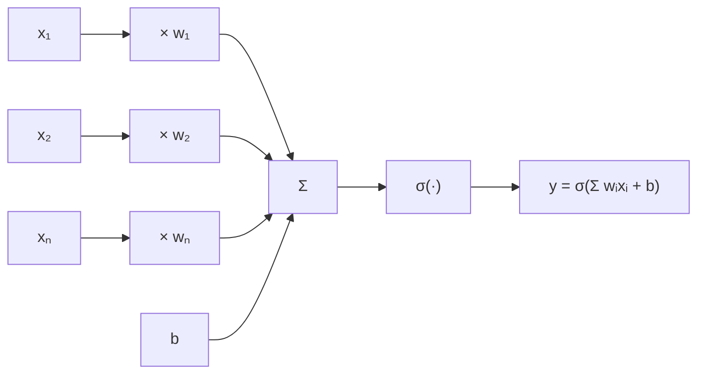
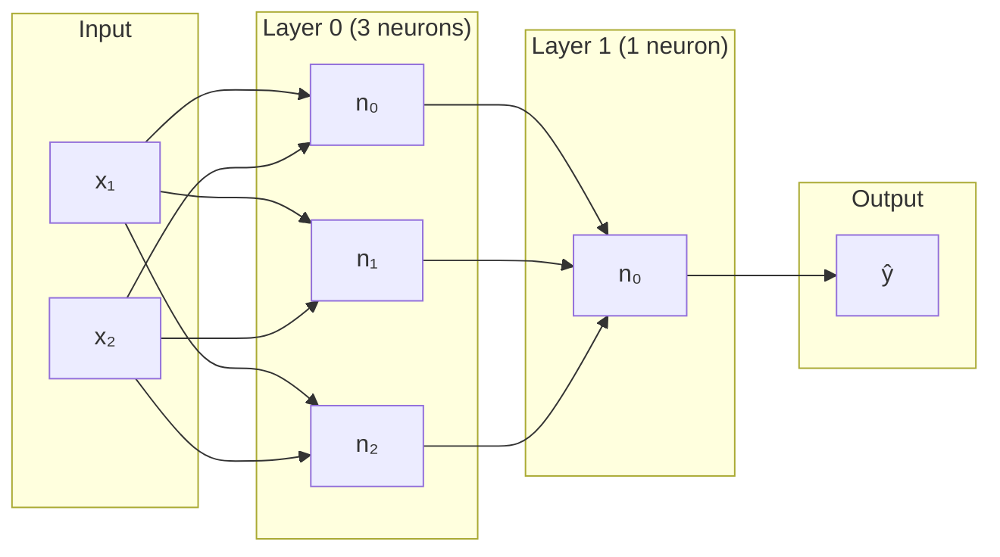
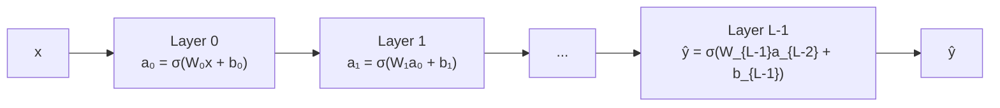
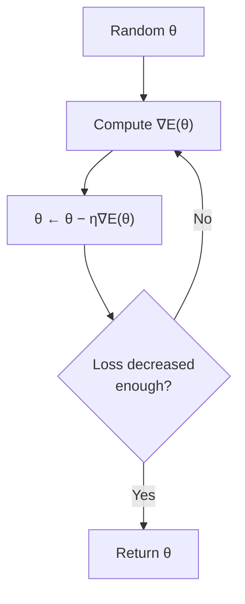
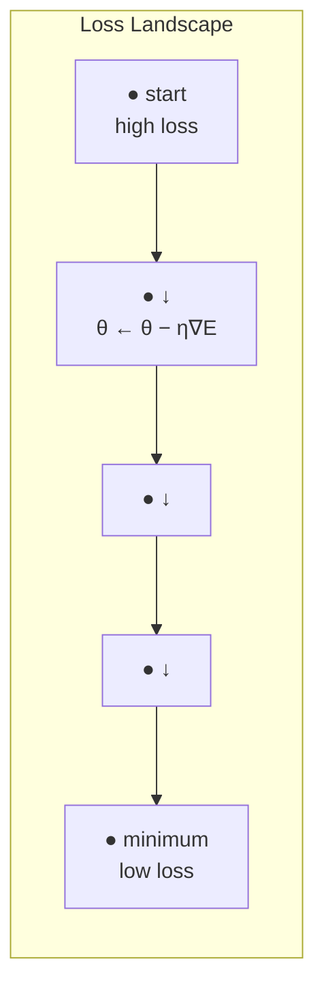
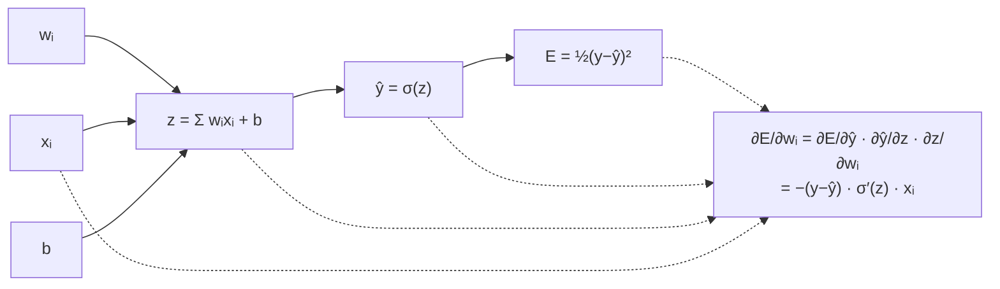
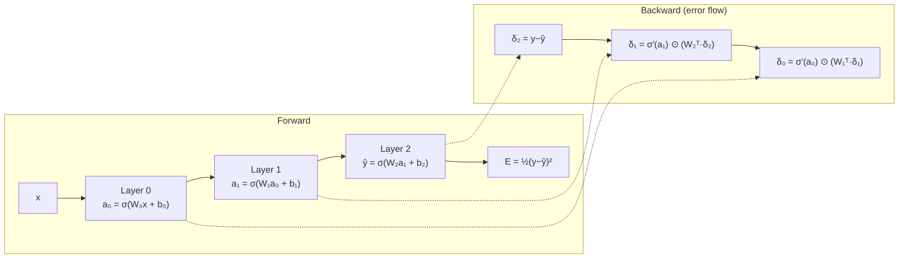
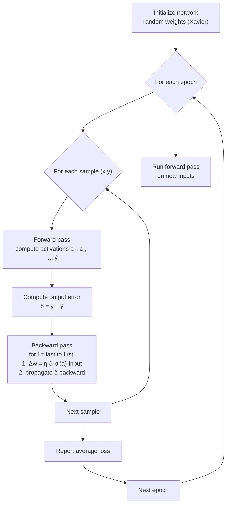
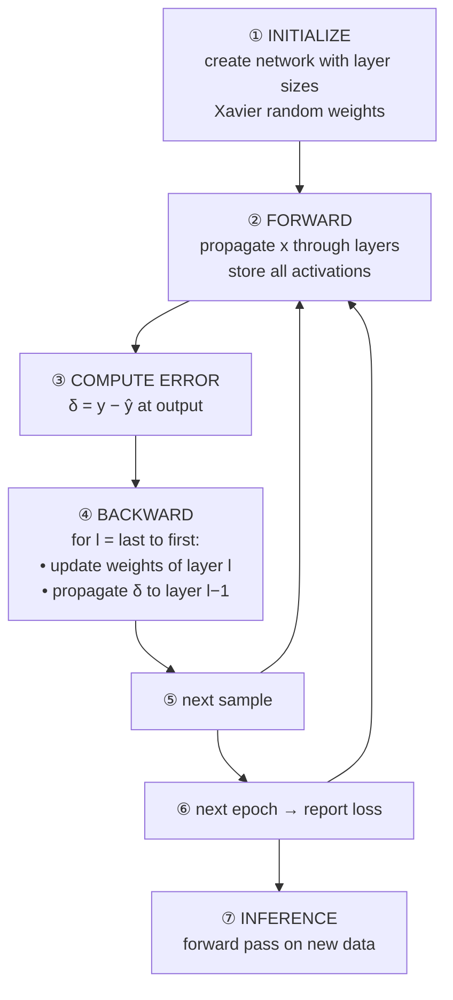
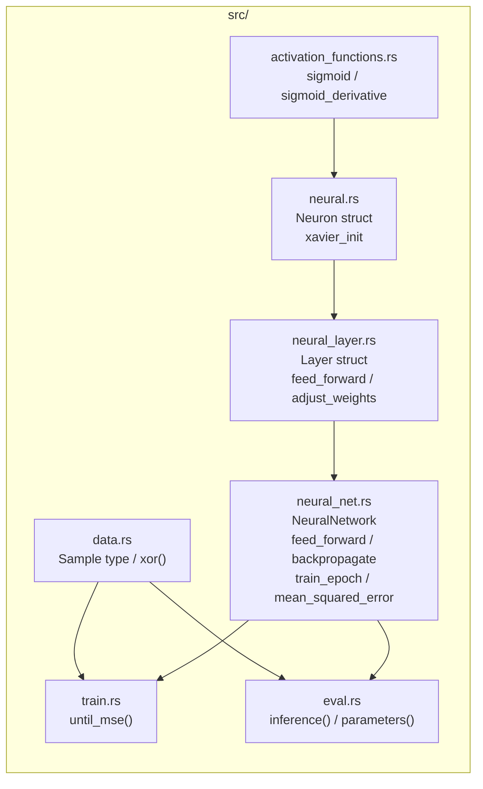

# Neuron — From First Principles

This document derives a neural network from scratch. No code, no libraries — just the problem and the chain of reasoning that leads to each concept. Once the ideas are solid, the actual Rust implementation in `src/` becomes obvious.

---

## Prologue: The Problem

We have data. Pairs of inputs and outputs: $(x_1, y_1), (x_2, y_2), \dots$. We want a function $f$ such that $f(x_i) \approx y_i$, and ideally $f$ generalizes to unseen $x$.

Classic approach: pick a parametric family (e.g. linear: $f(x) = wx + b$) and tune $w, b$ to minimize error. Works when the relationship is linear. Fails when it isn't.

**Origin question**: How do we build a function approximator that can learn *any* smooth relationship, given enough data and compute?

---

## 1. Linear Regression → Neuron

### Where it starts

The simplest learnable unit:

$$
\hat{y} = wx + b
$$

- $w$ — weight (how much to amplify/attenuate the input)
- $b$ — bias (prediction when input is zero)

### Its limitation

A single weighted input can only represent lines. The XOR problem is impossible: no straight line separates {(0,0), (1,1)} from {(0,1), (1,0)}.

### Deriving the neuron

We need more expressiveness:
- **Multiple inputs**: the real world has many features. $\hat{y} = \sum_i w_i x_i + b$.
- **Multiple outputs**: one weighted sum per output. That's a layer of independent linear units.

But stacking linear units is pointless: $W_2(W_1 x + b_1) + b_2 = (W_2 W_1)x + (W_2 b_1 + b_2)$ — still linear.

**Breakthrough**: insert a non-linear function $\sigma$ after each weighted sum.

$$
y = \sigma\left(\sum_i w_i x_i + b\right)
$$

This is the **artificial neuron**. $\sigma$ is the **activation function**. The non-linearity is what makes stacking layers powerful — composition of non-linear functions can represent any continuous function (universal approximation theorem).

### Single neuron diagram



### Activation function — where sigmoid comes from

We need a differentiable non-linearity (for gradient-based learning, see §4). Candidates:

| Function | Formula | Range | Why used |
|---|---|---|---|
| Step | $1_{z>0}$ | {0,1} | Not differentiable |
| Sigmoid | $1/(1+e^{-z})$ | (0,1) | Smooth, interpretable as probability |
| Tanh | $(e^z-e^{-z})/(e^z+e^{-z})$ | (-1,1) | Zero-centered, often better gradient flow |
| ReLU | $\max(0,z)$ | [0,∞) | Cheap, no saturation for $z>0$ |

Sigmoid arises naturally from:
- **Logistic regression**: modeling probability of binary outcome.
- **Smooth approximation of a step function**: the logistic function $\sigma(z) = 1/(1+e^{-z})$ is the "soft" version of a hard threshold.
- **Derivative is simple**: $\sigma'(z) = \sigma(z)(1-\sigma(z))$ — expressed in terms of the output itself, computationally convenient.

### Summary

```
Problem: linear models too weak
Solution: non-linear activation after weighted sum
Result: neuron = σ(Σ wᵢxᵢ + b)
```

---

## 2. Weight Initialization — Where Xavier Comes From

### The problem

Start training with random weights. What distribution?

- **Zero**: all neurons compute same thing → no learning (symmetry).
- **Too large**: sigmoid saturates → gradient near zero → no learning.
- **Too small**: signals vanish through layers → no learning.

### Deriving Xavier init

We want the variance of activations to remain constant across layers.

Let layer $l$ have $n$ inputs. Each $x_i$ has variance $\text{Var}(x)$. Weights $w_i$ are i.i.d. with variance $\text{Var}(w)$. Then:

$$
\text{Var}(z) = \text{Var}\left(\sum_i w_i x_i\right) = n \cdot \text{Var}(w) \cdot \text{Var}(x)
$$

To keep variance stable, set $\text{Var}(z) = \text{Var}(x)$:

$$
n \cdot \text{Var}(w) = 1 \quad\Rightarrow\quad \text{Var}(w) = \frac{1}{n}
$$

For a uniform distribution $\text{Uniform}(-a, a)$, variance is $a^2/3$. Solving:

$$
\frac{a^2}{3} = \frac{1}{n} \quad\Rightarrow\quad a = \frac{\sqrt{3}}{\sqrt{n}}
$$

So $w \sim \text{Uniform}\left(-\frac{\sqrt{3}}{\sqrt{n}}, \frac{\sqrt{3}}{\sqrt{n}}\right)$.

The code simplifies to $\text{Uniform}(-1, 1) / \sqrt{n}$ — same variance, different distribution shape, works fine in practice.

### Summary

```
Problem: bad initialization kills learning
Constraints: keep variance stable across layers, stay in active region of sigmoid
Solution: Xavier/Glorot init
```

---

## 3. Forward Pass — Stacking Layers

### Origin

A single neuron can learn a decision boundary. A layer of neurons learns multiple features. But some problems require hierarchical features: edges → shapes → objects.

Stack layers: output of layer $l$ becomes input to layer $l+1$.

### Network topology



### Data flow



Each layer transforms its input. The composition $F(x) = f_{L-1} \circ f_{L-2} \circ \dots \circ f_0(x)$ is the network.

### Why multiple layers?

- **Shallow network** (1 hidden layer): universal approximator, but may need exponentially many neurons.
- **Deep network**: can represent same function with far fewer total parameters, by reusing learned features hierarchically.

### Summary

```
Problem: single layer can't learn hierarchical features
Solution: compose layers
Result: forward pass = sequential matrix-vector multiplies with non-linearities
```

---

## 4. Training — Gradient Descent

### The insight

We have a parametric function $F(x; \theta)$ where $\theta$ is all weights and biases. We have a loss function $E(\theta)$ measuring prediction error over training data. We want $\theta$ that minimizes $E$.

**Idea**: if we can compute $\nabla_\theta E$ (the gradient — direction of steepest increase), then $-\nabla_\theta E$ points toward lower loss. Walk downhill:

$$
\theta \leftarrow \theta - \eta \nabla_\theta E
$$

where $\eta$ is the **learning rate** (step size).

### Gradient descent visual



### Loss landscape concept



### Why gradient descent (not analytic solution)?

- Linear regression has a closed form: $\theta = (X^T X)^{-1} X^T y$. But inverting $X^T X$ is $O(n^3)$, prohibitive for large $n$.
- Neural networks have no closed form — non-linear activation makes the loss non-convex.
- Gradient descent is iterative, online, and scales to huge datasets (stochastic variants).

### What does the derivative look like for one weight?

For a single neuron at the output layer:

$$
E = \frac{1}{2}(y - \hat{y})^2 \quad\text{(mean squared error)}
$$

Chain rule:

$$
\frac{\partial E}{\partial w_i} = \frac{\partial E}{\partial \hat{y}} \cdot \frac{\partial \hat{y}}{\partial z} \cdot \frac{\partial z}{\partial w_i}
$$

where $z = \sum w_i x_i + b$ and $\hat{y} = \sigma(z)$.



$$
\frac{\partial E}{\partial \hat{y}} = -(y - \hat{y})
\qquad
\frac{\partial \hat{y}}{\partial z} = \sigma'(z)
\qquad
\frac{\partial z}{\partial w_i} = x_i
$$

So:

$$
\frac{\partial E}{\partial w_i} = -(y - \hat{y}) \cdot \sigma'(z) \cdot x_i
$$

Gradient descent update (moving opposite to gradient):

$$
w_i \leftarrow w_i + \eta \cdot \underbrace{(y - \hat{y})}_{\text{error}} \cdot \sigma'(z) \cdot x_i
$$

The `+` appears because we defined error as $y - \hat{y}$ instead of carrying the negative sign.

### Summary

```
Problem: no closed-form solution for neural network weights
Solution: iterative gradient descent
Key: need gradient of loss w.r.t. every weight
```

---

## 5. Backpropagation — Distributing Error

### The challenge

We know how to update output layer weights (above). But how do we update *hidden* layer weights? The hidden layer doesn't directly see the loss.

### The tool: chain rule (multivariable)

The error at a hidden neuron $j$ is the sum of errors it causes in the next layer, weighted by connection strengths, scaled by the local derivative.

For layer $l$ with error $\delta^{(l)}$ and weights $W^{(l+1)}$ connecting to layer $l+1$:

$$
\delta_j^{(l)} = \sigma'(z_j^{(l)}) \cdot \sum_k w_{jk}^{(l+1)} \delta_k^{(l+1)}
$$

Then update weights:

$$
\Delta w_{ij}^{(l)} = \eta \cdot \delta_j^{(l)} \cdot x_i^{(l)}
$$

### Forward and backward flow



### Algorithm

```
1. Forward pass: compute and store all activations
2. Compute output error: δ^(L) = y - ŷ
3. For l = L-1 down to 0:
   a. Update weights of layer l using stored input activations and δ^(l)
   b. Propagate error backward: compute δ^(l-1) from δ^(l) and W^(l)
```

This is **backpropagation**: errors flow backward through the same network, using the same weights.

### Training loop — full picture



### Where the name comes from

The error signal "back-propagates" — it starts at the output and spreads backward, layer by layer, exactly like the forward pass but in reverse.

### The code factoring choice

In this implementation, the sigmoid derivative $\sigma'$ is applied **inside** `adjust_weights`, not during error propagation. The error vector $\delta$ is stored *pre-derivative*. This is equivalent math:

$$
\Delta w_{ij}^{(l)} = \eta \left(\sum_k w_{jk}^{(l+1)} \delta_k^{(l+1)}\right) \cdot \sigma'(z_j^{(l)}) \cdot x_i
$$

It separates concerns: error propagation is linear (just weight matrices), non-linearity is local to each layer's update.

### Summary

```
Problem: hidden layers don't directly see the loss
Solution: chain rule through the network
Result: error flows backward, weight by weight
Name: backpropagation
```

---

## 6. The Complete Learning Loop

Putting all the pieces together:



This is a complete learning system. Every piece follows inevitably from the starting assumptions:
- We want a parametric function approximator → neuron
- Linear is too weak → non-linear activation
- Need to minimize error → gradient descent
- Need gradients for all parameters → backpropagation via chain rule

---

## 7. Where to Go From Here

These ideas originated in the 1950s–1980s. Modern deep learning extends them in every direction:

| Origin | Modern extension |
|---|---|
| Sigmoid | ReLU, GELU, Swish |
| MSE loss | Cross-entropy, Huber |
| Full-batch GD | SGD, Adam, AdamW |
| Xavier init | He init, orthogonal init |
| Sequential layers | Residual connections, attention |
| Single-task | Transfer learning, fine-tuning |
| Manual derivatives | Automatic differentiation |

---

## 8. How This Maps to the Code

The Rust files in `src/` implement exactly the derivation above, nothing more:



## Code Map

| Concept | Module / symbol |
|---|---|
| Neuron: weights, bias, activation | `neural.rs` — `Neuron`, `Neuron::activate()` |
| Sigmoid + derivative | `activation_functions.rs` — `sigmoid()`, `sigmoid_derivative()` |
| Weight initialization (Xavier) | `neural.rs` — `xavier_init()` |
| Layer: collection of neurons | `neural_layer.rs` — `Layer`, `feed_forward()`, `adjust_weights()` |
| Network: stack of layers | `neural_net.rs` — `NeuralNetwork` |
| Forward pass through all layers | `NeuralNetwork::feed_forward()` |
| Backpropagation (single sample) | `NeuralNetwork::backpropagate()` |
| Error propagation (chain rule) | backward loop in `backpropagate()` |
| Gradient descent weight update | `Layer::adjust_weights()` |
| Training epoch + MSE computation | `NeuralNetwork::train_epoch()`, `mean_squared_error()` |
| Training loop (until convergence) | `train.rs` — `until_mse()` |
| Inference + parameter inspection | `eval.rs` — `inference()`, `parameters()` |
| Sample datasets | `data.rs` — `xor()`, `Sample` type |
| Binary entry point | `main.rs` |
| Interactive network visualizer | `visualize.rs` — `visualize()` builds an egui graph, supports layer visibility/solo controls |


If the code were deleted, you could reconstruct it entirely from the reasoning chain above.

